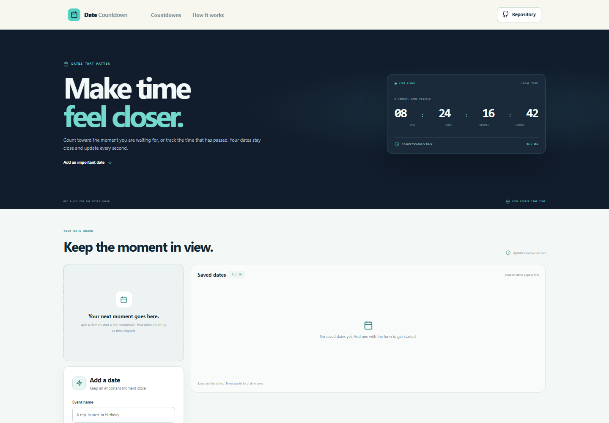



# Date Countdown Tool

Keep dates that matter in a live countdown list. Add a local date and time, watch the remaining days and clock units update each second, or track elapsed time after an event has passed.

**Live app:** [https://a2rp.github.io/date-countdown-tool/](https://a2rp.github.io/date-countdown-tool/)

## What you can do

- Add up to 20 named events with a local date and time.
- Use quick presets for tomorrow morning, New Year, or one month from now.
- Select an event to feature its timer, with days, hours, minutes, and seconds.
- See a countdown for future dates or elapsed time for past dates.
- Review the saved list, ordered with the nearest future dates first.
- Remove an event after confirming which date will be removed.
- Keep the event list in browser storage on this device.

## Dates and storage

The date field and display use the time zone set on your device. Saved events are stored in `localStorage` under `date-countdown-events-v1`. They are not uploaded or synchronized with another browser. The list is limited to 20 events and event names to 48 characters. Deleting an event removes it from local storage after confirmation.

## Run locally

Requires Node.js and npm.

```sh
npm install
npm run dev
```

Run the tests, check the code with ESLint, and create a production build:

```sh
npm test
npm run lint
npm run build
```

Publish the production build to GitHub Pages with:

```sh
npm run deploy
```

## Future improvements

These are ideas for later versions and are not implemented yet:

- Add recurring events such as birthdays and annual renewals.
- Add optional notes and custom colors for each date.
- Add calendar export for selected events.

## Links

- Portfolio: [https://www.ashishranjan.net](https://www.ashishranjan.net)
- GitHub: [https://github.com/a2rp](https://github.com/a2rp)
- CodePen: [https://codepen.io/ash1198](https://codepen.io/ash1198)
- LinkedIn: [https://www.linkedin.com/in/aashishranjan](https://www.linkedin.com/in/aashishranjan)
- Facebook: [https://www.facebook.com/theash.ashish/](https://www.facebook.com/theash.ashish/)
- YouTube: [https://www.youtube.com/@ashishranjan-ashz?sub_confirmation=1](https://www.youtube.com/@ashishranjan-ashz?sub_confirmation=1)
- Email: [mailto:ash.ranjan09@gmail.com](mailto:ash.ranjan09@gmail.com)

## Support

- Support: [https://a2rp-donation-page.netlify.app/](https://a2rp-donation-page.netlify.app/)
- Buy Me a Coffee: [https://buymeacoffee.com/ashishranjan](https://buymeacoffee.com/ashishranjan)
- Patreon: [https://www.patreon.com/ashishranjan](https://www.patreon.com/ashishranjan)
